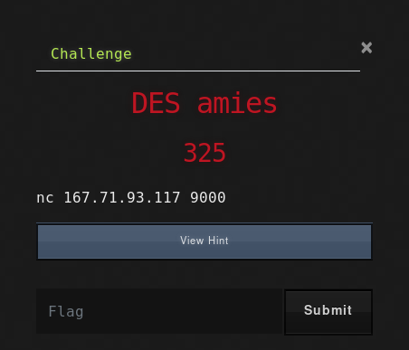

		DESAmies is a Cryptography challeng
		writ-up by Abdallah EL-Shinbary 
		
		

First of all we have a network connection that asks	for input and gives us what looks like encrypted message. 

		<h3>It's just that nothing.</h3>

Looking at the challenge name I assume that It's DES encryption and we have to decrypt the message somehow.

		
Honestly I wasn't able to solve it without the hint which says "Strong key".

		
Hmmmm if there is a strong key then there is a weak key.

After some googling I discovered that DES implementation has some 'weak keys' that if you encrypt with them twice you will get the original message

		<h3>"Original" ---enc---> "Encrypted" ---enc---> "Original"</h3>

		
Now that's awesome we just have to try every key and wish it will work.

		
After trying the key this one worked and we got this message :)

		
Key: 0xFFFFFFFFFFFFFFFF

from pwn import * 
from des import DesKey 
 
conn = remote('167.71.93.117', 9000) 
 
conn.send('aaaaaaaa') 
x = conn.recvline(); 
s = x[41:-1] 
 
keys = [ 
	b'\x00\x00\x00\x00\x00\x00\x00\x00', 
	b'\x00\x00\x00\x00\xFF\xFF\xFF\xFF', 
	b'\xFF\xFF\xFF\xFF\x00\x00\x00\x00', 
	b'\xFF\xFF\xFF\xFF\xFF\xFF\xFF\xFF', 
] 
 
for k in keys: 
	key = DesKey(k) 
	y = key.encrypt(s) 
	print(y) 
	print()

